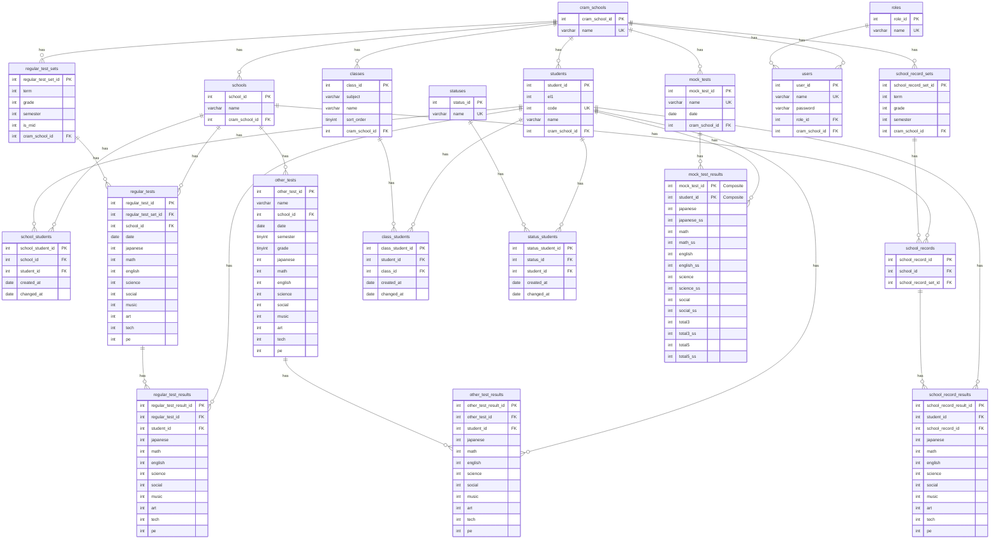

```mermaid

erDiagram
    cram_schools ||--o{ schools : has
    cram_schools ||--o{ students : has
    cram_schools ||--o{ classes : has
    cram_schools ||--o{ regular_test_sets : has
    cram_schools ||--o{ mock_tests : has
    cram_schools ||--o{ school_record_sets : has
    cram_schools ||--o{ users : has

    schools ||--o{ school_students : has
    schools ||--o{ regular_tests : has
    schools ||--o{ school_records : has
    schools ||--o{ other_tests : has

    students ||--o{ class_students : has
    students ||--o{ school_students : has
    students ||--o{ status_students : has
    students ||--o{ regular_test_results : has
    students ||--o{ mock_test_results : has
    students ||--o{ school_record_results : has
    students ||--o{ other_test_results : has

    classes ||--o{ class_students : has

    statuses ||--o{ status_students : has

    regular_test_sets ||--o{ regular_tests : has
    regular_tests ||--o{ regular_test_results : has

    mock_tests ||--o{ mock_test_results : has

    school_record_sets ||--o{ school_records : has
    school_records ||--o{ school_record_results : has

    other_tests ||--o{ other_test_results : has

    roles ||--o{ users : has

    cram_schools {
        int cram_school_id PK
        varchar name UK
    }

    schools {
        int school_id PK
        varchar name
        int cram_school_id FK
    }

    students {
        int student_id PK
        int el1
        int code UK
        varchar name
        int cram_school_id FK
    }

    classes {
        int class_id PK
        varchar subject
        varchar name
        tinyint sort_order
        int cram_school_id FK
    }

    statuses {
        int status_id PK
        varchar name UK
    }

    regular_test_sets {
        int regular_test_set_id PK
        int term
        int grade
        int semester
        int is_mid
        int cram_school_id FK
    }

    regular_tests {
        int regular_test_id PK
        int regular_test_set_id FK
        int school_id FK
        date date
        int japanese
        int math
        int english
        int science
        int social
        int music
        int art
        int tech
        int pe
    }

    mock_tests {
        int mock_test_id PK
        varchar name UK
        date date
        int cram_school_id FK
    }

    school_record_sets {
        int school_record_set_id PK
        int term
        int grade
        int semester
        int cram_school_id FK
    }

    roles {
        int role_id PK
        varchar name UK
    }

    users {
        int user_id PK
        varchar name UK
        varchar password
        int role_id FK
        int cram_school_id FK
    }

    class_students {
        int class_student_id PK
        int student_id FK
        int class_id FK
        date created_at
        date changed_at
    }

    school_students {
        int school_student_id PK
        int school_id FK
        int student_id FK
        date created_at
        date changed_at
    }

    status_students {
        int status_student_id PK
        int status_id FK
        int student_id FK
        date created_at
        date changed_at
    }

    regular_test_results {
        int regular_test_result_id PK
        int regular_test_id FK
        int student_id FK
        int japanese
        int math
        int english
        int science
        int social
        int music
        int art
        int tech
        int pe
    }

    mock_test_results {
        int mock_test_id PK "Composite"
        int student_id PK "Composite"
        int japanese
        int japanese_ss
        int math
        int math_ss
        int english
        int english_ss
        int science
        int science_ss
        int social
        int social_ss
        int total3
        int total3_ss
        int total5
        int total5_ss
    }

    school_records {
        int school_record_id PK
        int school_id FK
        int school_record_set_id FK
    }

    school_record_results {
        int school_record_result_id PK
        int student_id FK
        int school_record_id FK
        int japanese
        int math
        int english
        int science
        int social
        int music
        int art
        int tech
        int pe
    }

    other_tests {
        int other_test_id PK
        varchar name
        int school_id FK
        date date
        tinyint semester
        tinyint grade
        int japanese
        int math
        int english
        int science
        int social
        int music
        int art
        int tech
        int pe
    }

    other_test_results {
        int other_test_result_id PK
        int other_test_id FK
        int student_id FK
        int japanese
        int math
        int english
        int science
        int social
        int music
        int art
        int tech
        int pe
    }

```

